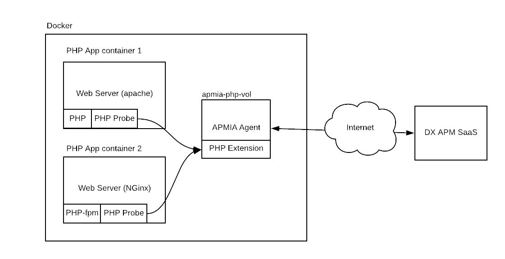

# apmia_php_ext_volume 1.0-4 by J. Mertin -- joerg.mertin@broadcom.com
Purpose: APMIA Agent/Passive PHP Extension volume for docker

# Description
### Image description

This image build kit will create a passive image containing the PHP
extension and/or APMIA Agent that can be started by a container at
will.   
   
Depending on its deployment, it will implant the php-probe, or start
up an APMIA collector already configured and connected to the DX APM
SaaS environment it was downloaded from.

### Functional description of the PHP Agent/Probe

The below graph describes the setup in general.   


The general approach to deploy the PHP Agent/Probe in an environment is as follows:

1. Deploy the Infrastructure Agent that 
    - sends monitoring data to the private or public cloud data collector
    - hosts the PHP extension
2. Deploy and activate the PHP extension inside the IA. The extension proxies data:
    - sends monitoring data to the IA (Infrastructure Agent)
    - receives monitoring data from the PHP probe (Installed at the WebServer Level/PHP section)
3. Deploy the PHP probe into one or more PHP installations. The probe captures monitoring data and sends them to the PHP extension (on port 5005 - by default)

**Note**: One IA (Infrastructure Agent) with the PHP Extension can receive monitoring data from multiple PHP Probes.   
To save resources you can therefore deploy only one IA with the PHP extension to serve multiple PHP probes.
Because the IA is heavyweight (Java) and the PHP probe is lightweight, about ~3MBytes).   
**Note 2**: Reduce the network path/hops the PHP Probe has to pass to transfer its findings to the IA (Infrastructure Agent). The network induce I/O can have an impact on the overall network infrastructure on highly loaded WebServers. The best approach is to use one IA per physical machine in the Docker cluster.

This documentation describes how to deploy an IA in a docker container and how to deploy a PHP probe in other docker containers for a resource efficient setup.


#### Dependency

None. It provides the PHP Probe and the APMIA Agent.

#### Restrictions

- The APMIA image will share its /opt/apmia (default installation path inside the docker container) directory to other containers.   
This means that the configuration files, log-files etc. can be modified by any instance. So be careful which instance modifies any file in the /opt/apmia directory

### How to use this image

The idea is to use the APMIA Agent and the Probes in the same
environment, while only one APMIA Agent is required, many PHP probes
can report their data to it.

Using the Docker environment, a dedicated subnet will be created
connecting the APMIA and the probes together. Hence there will be no
requirement to open any ports. As all required incoming connections
will already be inside the docker LAN, and all other communication
flows will be initiated by the APMIA Agent to the outside world, in 
this case the DX APM SaaS Instance.   

To correctly use this image, the following steps must be undertaken:   
1. Deploy the APMIA as an Agent (Deploying as a APMIA Agent)   
   One APM IA needs to run to collect the data from the PHP Probes
2. Install the APM PHP Probe (Deploying as PHP Probe) one or more times. This requires:   
   - mount the /opt/apmia volume of the deployed APMIA Agent into the deployed container hosting the PHP application
   - Modify the startup script of PHP Application container to include the implantation of the PHP probe into the PHP configuration


### Deploying as a APMIA Agent

Deploying as APMIA container is pretty straight forward.

Add the following into the docker-compose file:
```
  # Using the php-extension volume
  apmia-php-vol:
    image: mertin/apmia_php_ext_volume:latest
    container_name: apmia_container
    environment:
      # APMIA Configuration. Flag set to false creates a passive volume!
      - APMIA_DEPLOY=true
      - APMIA_AGENT_DISPLAYED_HOSTNAME=apmia-pod
      - APMIA_APP_NAME=php-collector
      - APMIA_LOG_LEVEL=WARNING
      - APMIA_INTROSCOPE_AGENTNAME=apmia
    volumes:
      - /opt/apmia
```
**Note 1**: The volumes "/opt/apmia" is very important if one wants to use the same image for deploying the probes. See next chapter.   
**Note 2**: Do not use spaces in the app names. The installer does not like it.   


In the configuration, the following can be influenced:
- APMIA_DEPLOY [true|false]: Instructs the start script to either launch the APMIA Agent, or simply skip it and return a true exit value. Defaults to false
- APMIA_AGENT_DISPLAYED_HOSTNAME [default: apmia-container]: Hostname, default toi apmia-container. Docker will always create a random 16char hostname which looks bad in the Investigator.
- APMIA_APP_NAME [default: php-collector]: Application name, defaults to php-collector
- APMIA_LOG_LEVEL [default: WARNING] Log level is set to WARNING by default, to keep chattiness low.
- APMIA_INTROSCOPE_AGENTNAME [default: apmia]: Agent name

If the APMIA_DEPLOY tag is set to "true" - the APMIA Infrastructure Agent will deploy. If it is set to "false" this image will remain passive (no application will be run.   

**NOTE**: In passive mode, the container will exist and have a "Exit" status. This is normal!   
   

### Deploying as PHP Probe 

In a docker-compose file - set version to '2' - one needs to create a passive volume inclusion.

Even if you don't deploy the APMIA Container, it will have to exist in the docker-compose file as previous described (see "Deploying as a APMIA Agent"). The PHP Probes requires the image content to implant the probe binaries into the application php environment.   
If you don't want a APMIA Agent to run, set the "APMIA_DEPLOY=false". This will cause it to be a passive image.   


And in the application one wants to mount the passive image, add in the "volumes_from" section and the "environment" section:
```
version: '2'
[...]
    environment:
      - PHP_DEPLOY=true
      - PHP_APPNAME=PCM_App
      - PHP_AGENT_DISPLAYED_HOSTNAME=pcm-dev
      - PHP_LOGDIR=/var/log
      - PHP_IAHOST=apmia_container
      - PHP_IAPORT=5005
    volumes_from:
      - apmia-php-vol:rw
```   
**Note**: In case the mount directory is not /opt/apmia - the installer script needs to be modified!   
**Note 2**: The PHP_IAHOST needs to match the container-name of the APMIA container or the APMIA Host!   
**Note 3**: The "apmia-php-vol" refers to APMIA Agent section (see "Deploying as a APMIA Agent").   
**Note 4**: Do not use spaces in the app names. The installer does not like it.   

To influence the installation of the PHP probe, one can use the following variables to be exposed in the docker-compose file:

- PHP_APPNAME: Sets the name of the Frontend application under which metrics will be reported. It is highly recommended to set an application name. Default value is "PHP App"
- PHP_AGENT_DISPLAYED_HOSTNAME: Sets custom agent hostname for PHP Probe agent
- PHP_IAHOST: Hostname/IP address of remote machine on which Infrastructure agent is running and listening for Probe agents.   
  If Infrastructure agent is running on the same machine as Probe agent this param can be ignored. Defaults to localhost if not set
- PHP_IAPORT: Port on which Infrastructure agent is listening for Probe agents (defaults to 5005 if not set)
- PHP_ROOT: PHP root directory
- PHP_EXT: PHP modules directory
- PHP_INI: PHP ini directory
- PHP_LOGDIR: PHP probe agent logs directory. WARNING: As this is a shared VOLUME, do not set the log directory to be in it!
- PHP_DEPLOY [true:false]: Trigger to install the probe
- PHP_PROBE_DIR: Directory the probe files exists. Defaults to /opt/apmia

For the php-probe to be implanted, the following code/script snippet has to be implanted into the "application" image run script, before the php-functionality is activated:
```
if [ "$PHP_DEPLOY" = "true" ]
then
    if [ -x ${PHP_PROBE_DIR:-/opt/apmia}/php-probe.sh ]
    then
       # Execute php-probe.sh
       /bin/sh ${PHP_PROBE_DIR:-/opt/apmia}/php-probe.sh
    else
       echo "*** FATAL: PHP deployment enabled, but probe-installer not found. Exiting!"
    fi
fi
```
Without that code snippet, the probe cannot be deployed.

### Building the apmia image

To create the APMIA Image, one need to provide the CLI Download link
of the PHP enabled APMIA package. Got to your DX APM SaaS Tenant, and
on the left side, into the "Agents" section => "Download
Agents". Under Applications select the "PHP" application.   
   
**NOTE**: The  **build_image.cfg** will be created on first run if non existent. The URL however nedes to be provided by the user.   
   
Open the "Command line Download" entry - and extract the URL and apply
it to the FILE Variable in the build_image.cfg file.

From the displayed:
```
wget --content-disposition 'https://apmgw.dxi-na1.saas.broadcom.com/acc/apm/acc/downloadpackage/43107?format=archive&layout=bootstrap_preferred&packageDownloadSecurityToken=233d4809807d21d1b24ae54639eede42f519dcbe35ca71d51bd051bca59c6a68'
```
extract only the URL
```
https://apmgw.dxi-na1.saas.broadcom.com/acc/apm/acc/downloadpackage/43107?format=archive&layout=bootstrap_preferred&packageDownloadSecurityToken=233d4809807d21d1b24ae54639eede42f519dcbe35ca71d51bd051bca59c6a68
```

You can download the Agent manually but will have to upload it into
the build directory - named as downloaded, for example:
"PHP-apmia-20200326_v1.tar"

Launch the build script - it will ask which steps to perform:
```
jmertin@calypso:~/docker/apmia_php_ext_volume$ ./build_image.sh 

>>> Download latest APMIA/PHP archive [y/n]?: n
apmia/manifest.txt
Updating tar archive. Adding php-probe.sh
Found PHP Monitor 20.1.0.44!

>>> Build APMIA/PHP image [y/n]?: y

*** If you want to apply OS Update, don't use the cache.
>>> Use cache for build [y/n]?: n
Sending build context to Docker daemon  204.3MB
Step 1/9 : FROM jeanblanchard/alpine-glibc:latest
 ---> 9c75e1ac1042
Step 2/9 : ARG PHP_EXTENSION_VER
 ---> Running in f8fdb81f1dc0
Removing intermediate container f8fdb81f1dc0
 ---> 931a0fdbfbe6
Step 3/9 : ARG PHP_EXTENSION_FILE
 ---> Running in 54a151fc7dda
Removing intermediate container 54a151fc7dda
 ---> ba87ab3637f4
Step 4/9 : RUN mkdir -p /opt/apmia
 ---> Running in c5e931136b2f
Removing intermediate container c5e931136b2f
 ---> 621e84efbf1f
Step 5/9 : COPY $PHP_EXTENSION_FILE /opt/${PHP_EXTENSION_FILE}.bin
 ---> 8198aa056ea4
Step 6/9 : ADD run.sh /
 ---> 63ded25baa16
Step 7/9 : RUN apk add bash nano && tar xf /opt/${PHP_EXTENSION_FILE}.bin -C /opt && rm -f /opt/${PHP_EXTENSION_FILE}.bin
 ---> Running in a3c4f2834a2b
fetch http://dl-cdn.alpinelinux.org/alpine/v3.11/main/x86_64/APKINDEX.tar.gz
fetch http://dl-cdn.alpinelinux.org/alpine/v3.11/community/x86_64/APKINDEX.tar.gz
(1/6) Installing ncurses-terminfo-base (6.1_p20200118-r2)
(2/6) Installing ncurses-libs (6.1_p20200118-r2)
(3/6) Installing readline (8.0.1-r0)
(4/6) Installing bash (5.0.11-r1)
Executing bash-5.0.11-r1.post-install
(5/6) Installing libmagic (5.37-r1)
(6/6) Installing nano (4.6-r0)
Executing busybox-1.31.1-r9.trigger
Executing glibc-bin-2.31-r0.trigger
/usr/glibc-compat/sbin/ldconfig: /usr/glibc-compat/lib/ld-linux-x86-64.so.2 is not a symbolic link

OK: 25 MiB in 23 packages
Removing intermediate container a3c4f2834a2b
 ---> 0c0861b0268d
Step 8/9 : RUN chmod g+w -R /opt/apmia /run.sh && chmod 555 /run.sh
 ---> Running in be4570b9cc76
Removing intermediate container be4570b9cc76
 ---> 7776cc921fae
Step 9/9 : CMD /run.sh
 ---> Running in 8994348c1bd1
Removing intermediate container 8994348c1bd1
 ---> 2e45076a06c3
Successfully built 2e45076a06c3
Successfully tagged mertin/apmia_php_ext_volume:latest
tagging to mertin/apmia_php_ext_volume:20.1.0.44
```

The image will be created and the version tag applied to the image tag.
```
jmertin@calypso:~/docker/apmia_php_ext_volume$ docker images | grep apmia_php
mertin/apmia_php_ext_volume   20.1.0.44                  2e45076a06c3        22 seconds ago      639MB
mertin/apmia_php_ext_volume   latest                     2e45076a06c3        22 seconds ago      639MB
```


# Manual Changelog
```
Fri Mar 27 10:52:53 CET 2020
- Initial release
```
